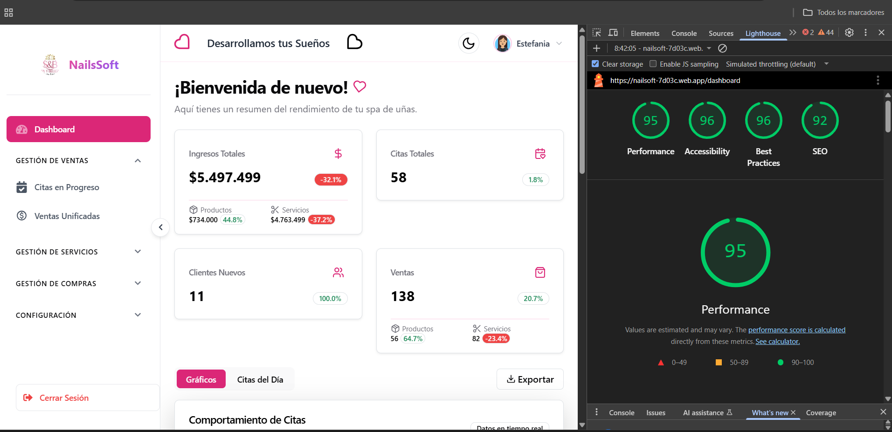
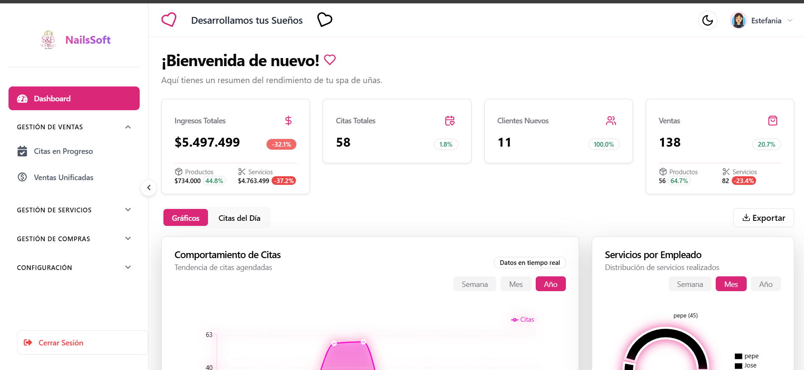
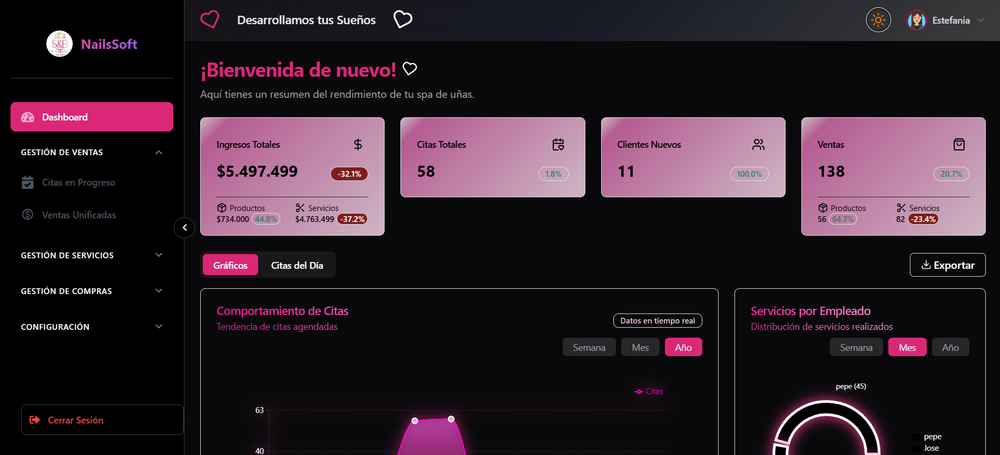
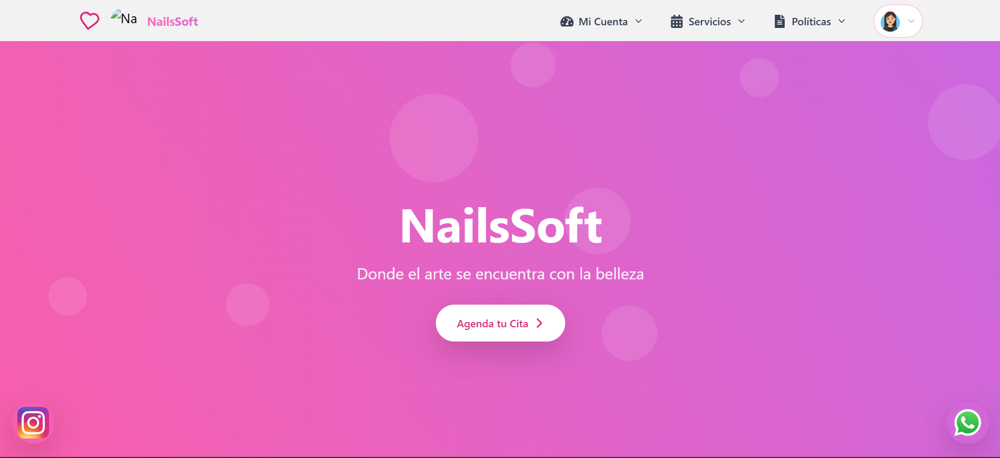
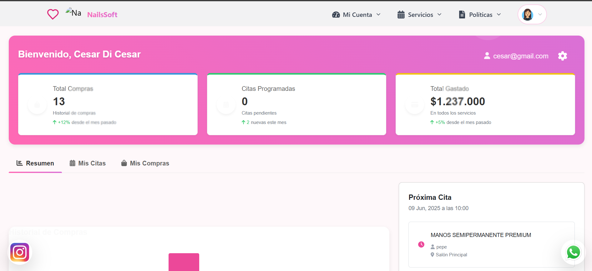
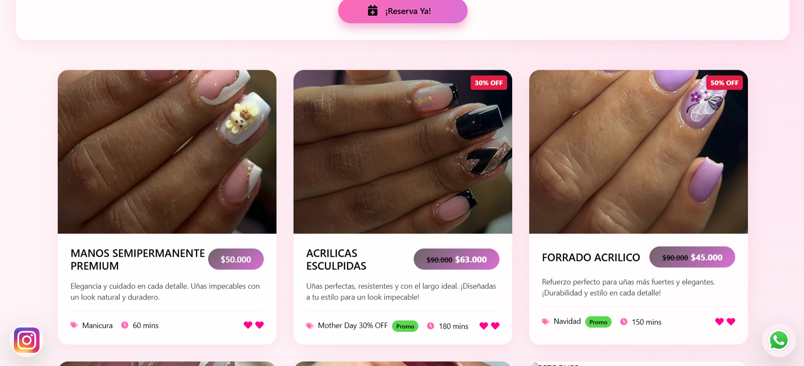
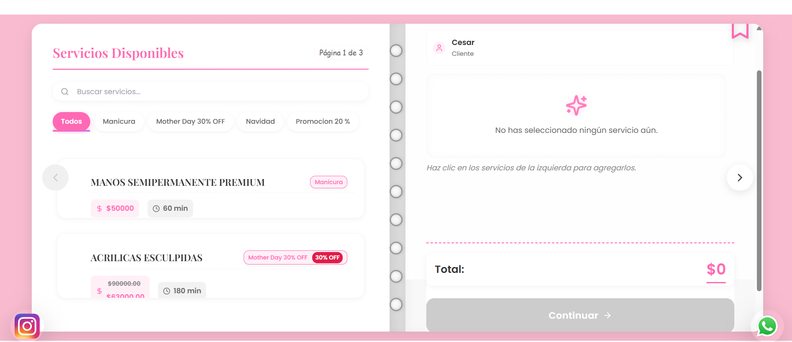

# Api_Backend_Front
# NailSoft - Sistema de Gestión para Spa "S&B"

## 🌐 Ver Aplicación Web 

[](https://nailsoft-7d03c.web.app/login)


NailSoft es un sistema integral para gestionar servic[ios mediante citas para diseño de uñas, permitiendo la selección de múltiples servicios, registro de ventas y compras de ](https://nailsoft-7d03c.web.app/login)insumos para el Spa "S&B".


 <!-- Reemplaza con la URL de tu logo -->

## Desarrollado por Equipo SENA NailSoft

- Sebastian Alvarez Restrepo
- Cristian Camilo Torres Arboleda
- Frank Javier Oronó Paternina
- Luis Mario Correa Gil

## Tecnologías Utilizadas

### Backend
- JavaScript
- Node.js
- Express

### Base de Datos
- MongoDB - ATLAS

### Frontend
- JavaScript
- Framework (React con Vite)
- Tailwind CSS
- Material UI
- CSS
- HTML

### Aplicación Móvil
- Dart
- Framework (Flutter)

## Instalación y Ejecución

### Requisitos Previos
- Node.js (v14 o superior)
- npm o yarn
- MongoDB

### Pasos para Instalación

# 1. Clonar el repositorio
git clone https://github.com/IHomoSapienI/ProyectoNailSoft.git
cd ProyectoNailSoft

# 2. Ejecutar backend
cd backend
npm install
cp .env.example .env # o crea el archivo manualmente
node index.js

# 3. Ejecutar frontend
cd ../frontend
npm install
npm run dev


5. El servidor está alojado en Render, donde se encuentran desplegadas todas las APIs.
En caso de presentarse algún problema, se debe realizar mantenimiento al backend y luego actualizar el repositorio correspondiente.

6. Iniciar la aplicación frontend:


```shellscript
cd frontend
npm run dev
```

## Vistas Disponibles

👥 Roles del Sistema

Administrador: Gestión completa (usuarios, servicios, reportes, etc.)

Empleado: Gestión de citas y servicios prestados

Cliente: Reserva de citas y visualización de servicios

Usuario: Registro e inicio de sesión

Altamente Escalable Gracias a los Permisos Dinamicos no dependemos de roles Estaticos


🌟 Características Destacadas
✅ Seguridad basada en estándares ISO 27001

🛡️ Gestión de permisos dinámicos según roles de usuario

🧱 Arquitectura escalable para facilitar el mantenimiento y crecimiento

💅 Diseño atractivo, pensado especialmente para el público femenino

🌗 Modo Día/Noche para mejor experiencia visual

⚡ Desempeño optimizado: calificación superior a 90 en Google Lighthouse

🔒 Confiabilidad en el manejo de datos

📊 Reportes estadísticos visuales y funcionales

📱 100% Responsive para visualización de los usuarios en móvil

📱 Versión móvil para monitoreo remoto del administrador

👨‍💻 Buenas prácticas de desarrollo y estructura de proyecto

## 📦 Despliegue
El servidor backend está alojado en Render, y todas las APIs están desplegadas para su uso en producción. En caso de fallos, se recomienda hacer mantenimiento al backend y actualizar el repositorio, El Frontend esta desplegado en Firebase .

## Estado del Proyecto
✅ Versión: 1.0.0
🚧 Estado: En desarrollo activo


## 🖼️ Galería de Vistas

## Metricas de LightHouse 


## DIseño Light para panel de Administrador
 

## Diseño Dark del panel de Administrador


## Landing Vista Cliente 


## Panel Reportes vista Cliente


## Galeria de Servicios Vista Cliente


## Vista de Agendamiento Cliente


